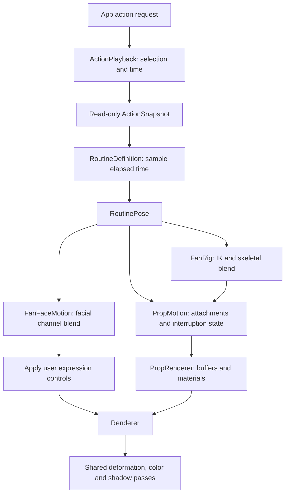

# Architecture

The app uses AppKit and MetalKit directly. `Scripts/build.sh` compiles Swift sources, bakes the legacy procedural mesh when needed, bundles assets, and ad-hoc signs the app. Metal source compiles at launch.

| Files under `Sources/BonziBuddy/` | Responsibility |
| --- | --- |
| `App.swift`, `main.swift` | Desktop panel, menus, local speech, launch flags, validation dispatch |
| `Renderer.swift`, `Shaders.metal` | Mesh buffers, skinning and morph uniforms, MSAA, lighting, shadow passes, presentation and profiling |
| `FanRig.swift`, `FanFaceMotion.swift` | Imported joint hierarchy, poses, choreography, interruption blends, automatic facial motion |
| `ActionPlayback.swift`, `Routines.swift`, `PropScene.swift`, `PropRenderer.swift` | Playback snapshots, routine intentions, prop lifecycle, semantic attachment, and polygon rendering |
| `Action.swift`, `Animation.swift` | Action catalog, legacy timing/reference curves, and procedural animation |
| `ExpressionControls.swift` | Native sliders for facial morphs, gaze, and eye closure |
| `Reminders.swift`, `ReminderControls.swift` | Local reminder persistence, delivery, and UI |
| `Character.swift`, `Mesh.swift` | Legacy procedural character generation and mesh formats |
| `*Validation.swift`, `FanPreview.swift`, `MeshChecks.swift` | Offline render reviews and numerical checks |

The default rigged fan model uses indexed polygon meshes, up to eight joint influences per vertex, and fifteen facial morph targets. Skinning and deformation are shared by color and shadow rendering. Bone buffers rotate through three in-flight slots. The renderer requests 120 Hz, uses 4× MSAA where supported, and filters a 2048² shadow map for soft shadows.

Runtime resources resolve inside the app bundle, so the built app works outside the checkout. Validation and research tools run from the repository root. `--procedural-model` selects the retained procedural comparison model.

Speech uses `AVSpeechSynthesizer`. Mute settings and reminders use local UserDefaults; typed speech is not stored. There are no external service integrations or installed background agents.

## Routine and prop boundaries

New routines use one registered `RoutineDefinition` for duration, facing policy, and a deterministic pose sampler. `GlobeRoutine`, `CoconutJuggle`, the two `BananaRoutine` variants, and `SunglassesRoutine` exercise this path. The older ten actions still contain legacy rig-specific curves; moving those curves into routine samplers remains work.

- **Playback owns time.** `ActionPlayback.sample` returns a snapshot without changing the selected clip. Completion maps to idle at the clip's end time; camera rendering and backward scrubbing cannot mutate selection. Hold-capable definitions now declare a loop range. Playback maps elapsed time into that range and schedules a return on request, completing the entrance first if necessary. The same phase identity persists across loop wraps; a return captures the current skeletal/facial pose for blending. Queues and persistent accessories independent of the current action remain unimplemented.
- **Routines describe intent.** A sampler takes elapsed time and returns hand targets, body/head orientation, facial channels, and prop cues. It performs no I/O and creates no GPU resources. Immutable `MotionTrack` values validate ordered keys once and sample bounded, eased scalar/vector values without rebuilding key arrays per frame. Randomized performances will need an explicit seed so repeated sampling remains deterministic.
- **The rig owns anatomy.** Routines address `HandSide` and `RigAttachment`, never source joint IDs. The shared hand intent includes an explicit grip channel. `FanRig.attachmentFrame` supports offsets in character axes or axes that rotate with the joint. Joint frames remove scale/shear so glasses or held books remain rigid when the character deforms.
- **Facial channels share interruption behavior.** Jaw, eyelid closure, gaze, and smile offset blend as one `FacialIntent`; manual expression controls apply afterward. Smile offsets preserve the user's chosen neutral smile on return. Additional imported facial morphs still have their existing manual controls; automatic tracks for those channels remain to be added.
- **Props have stable identity and typed state.** `PropCue` names an asset, semantic attachment, transform, visibility, and `PropDeformation`. Fruit trimming and independent peel ribbons do not expose Metal uniform lanes to choreography. A thrown object changes to a character-space trajectory; an attached object follows the solved rig. Anchors can include a local socket transform and blend between two rigid attachment frames, supporting hand-to-head transfers without per-routine renderer code.
- **Playback state is separate from rendering.** `PropScene.swift` owns cues, resolved draws, and `PropMotion`. Retiring snapshots live in character space, so changing camera angles rotates them correctly. The current interruption policy contracts outgoing props over 0.20 seconds; object-specific stow/catch behavior remains necessary for full fidelity.
- **The renderer owns representation.** `PropGeometry` and asset-specific geometry builders create reusable buffers. `PropRenderer` packs typed deformation parameters. Both Metal passes call `deformProp`, so an opening peel or shortened fruit casts the corresponding shadow. Adding a rigid asset must not accidentally activate a banana deformation; deformation mode is separate from material identity.

To add a routine, register its definition, author its pose/prop tracks, and supply any new asset geometry/material. Hand/head attachments, facial blending, camera changes, playback time, and generic interruption handling should require no routine-specific renderer or rig branches. New anatomical capabilities, such as a seated lower-body pose or a mouth contact marker, belong in the shared rig interface when a real routine needs them.

`--validate-routines` checks lifecycle bounds, channel values, unique prop identities, deformation/mesh compatibility, banana topology, attachment rigidity, camera invariance, and read-only playback seeking. Existing action-transition, prop-contact, neutral-image, and three-angle render checks remain separate: structural correctness does not prove visual fidelity.

`PropAssetData` reads a small, versioned indexed-mesh format, checking layout and indices before GPU upload. `Scripts/export-sunglasses.py` converts the fan model's existing glasses offline and fits them to the approved head shape. Generated props and imported prop assets use the same rendering path.
