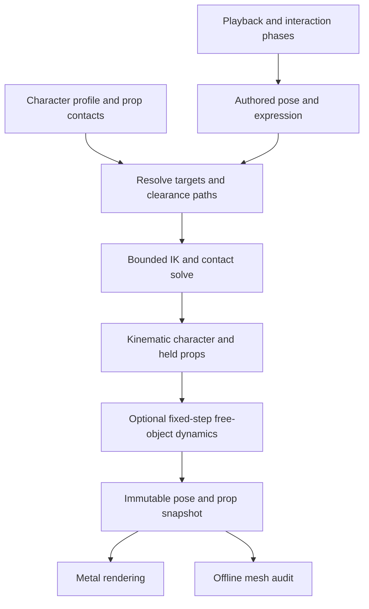

# Proposed shared character motion architecture

Status: design recommendation, not an implemented physics or retargeting system. No new engine, dependency, or service has been installed.

Use authored performances, adapted to each character with explicit contacts, inverse kinematics, and collision avoidance. Add selective dynamics for free objects and secondary motion. The [geometry audit](Audits/2026-09-05-hand-geometry/README.md) shows why: current hand axes accurately follow their targets, but the targets and paths allow hands to penetrate props. A rigid-body engine alone does not know how a character should grip a book or deliver a comic gesture.

## Contracts

| Layer | Owns |
| --- | --- |
| Character profile | Skeleton mapping, rest axes, limb lengths, joint limits and preferred bends, palm/finger geometry, contact markers, facial-channel mapping, wearable fitting, and supported capabilities. |
| Performance | Timing, anticipation, silhouette, gaze, facial intent, body motion, and named interaction phases. |
| Prop definition | Render geometry, collision proxies, semantic grip/contact sockets, deforming contact surfaces, and ownership rules. |
| Contact plan | Which surface touches which, allowed slip, clearance, activation window, release timing, and priority. |
| Pose solver | Reachability, hand orientation, elbow direction, finger articulation, foot planting, and bounded adjustments for clearance. |
| Dynamics backend | Optional free-prop motion, impacts, springs, and selected secondary motion. |
| Renderer / audit | Metal skinning and shading; offline verification against the actual deformed mesh. |

A routine should request “left palm supports globe underside” or “both hands hold book lower corners.” Its character profile translates those requests into bone and surface constraints. Canonical animation channels can share expressive intent such as smile, blink, and gaze, with per-character morph/bone mappings. Capabilities must be explicit: a character without fingers needs an alternate grasp or an unsupported-routine fallback. Different anatomy will still require art direction and character-specific variants.

A grip is a complete frame and contact region, not a wrist point. The prop socket and calibrated palm frame determine wrist placement and orientation; finger contact surfaces determine curl. For two-handed grips, designate the prop or one hand as the primary driver and solve the secondary hand against it. Do not make each hand and the prop independently chase each other in a circular attachment dependency.

## Evaluation and ownership

Keep solving in character/stage coordinates, independent of camera orientation. Solve after authored pose blending; recompute affected descendants before attachments and rendering. Contact activation/release should blend smoothly. Avoidance needs swept approach and retreat paths as well as end-pose clearance. Priorities should preserve primary grips and planted feet, then adjust elbow, shoulder, torso, or prop approach within authored limits. If constraints are infeasible, report the conflict and choose a declared fallback or another path; silently jittering between competing constraints is unacceptable.

Held props remain tightly controlled for reliable grips. A release transfers pose and linear/angular velocity to a dynamic object; a catch transfers ownership at a planned contact phase. Repeated juggling should retain directed ballistic paths and catch timing, even if a dynamics backend handles unexpected drops. Wearables remain independent persistent states and become collision obstacles for every subsequent gesture. Collision exceptions should name a contact region and phase, not disable an entire hand/prop pair.

A physics backend introduces state. Preserve current read-only rendering and scrubbing: advance simulation on fixed ticks in playback, publish immutable snapshots, and seek by deterministic replay from cached state. Rendering additional camera views must never advance the simulation. Fixed time steps alone do not guarantee cross-platform determinism; record seeds, input events, initial states, and backend settings for reproducible audits.

## Collision representation and performance

Use invisible capsules for arm/finger segments, fitted convex volumes for palms/body/props, and explicit surface models for paper and moving pages. These are collision proxies only; the visible character remains the approved polygon mesh. Calibrate proxies against actual mesh geometry so rounded cheeks, thick fingers, and thin covers are represented adequately. Broad-phase filtering and local swept queries keep routine checks bounded. Full skinned triangle readback is an offline audit tool, not a per-frame desktop requirement.

Budget the complete animation/physics/render pipeline against the 8.33 ms interval at 120 Hz and measure live presentation separately. Solver iterations and active contacts need explicit limits. The current app's 120 fps pacing remains unverified; this design is not a performance claim.

## Suggested implementation order

1. Extract the existing Bonzi-specific anatomical mapping into one character profile, retaining current appearance. Keep routine timing and prop identities intact.
2. Introduce shared grip/contact definitions and use them to correct the resting hands, book/paper transfers, and headphone grips identified by the audit.
3. Add joint limits, reachability reporting, proxy clearance, and swept transfer-path checks; incorporate worn accessories. Extend regression coverage to interrupted transfers and held loops.
4. Validate the abstraction with a second rig of different proportions. Measure contact error and nonpenetration against both meshes, and review multiple angles. Do this before generalizing every routine.
5. Evaluate a small embedded 3D physics library when free objects or secondary motion need it. Hide it behind a dynamics interface; retain the custom Metal renderer and current offline asset pipeline.

Jolt is a candidate for later evaluation, not a selected dependency. A motorized full-body ragdoll or learned physical controller would add tuning, state, and integration demands; it is unnecessary for the immediate contact problems. Physical plausibility should support the original's stylized performance, including intentional prop appearances and exaggerated poses.

## Technical references

- [ozz-animation IK documentation](https://guillaumeblanc.github.io/ozz-animation/documentation/ik/) describes post-blend IK, limb reachability, pole vectors, and softening. These support the proposed separation between authored pose and character-specific correction; no ozz dependency is proposed here.
- [Contact-Aware Retargeting of Skinned Motion, ICCV 2021](https://arxiv.org/abs/2109.07431) treats contact preservation and interpenetration using both skeleton and target geometry. This supports accounting for body shape when sharing motion; its learned method is not required by this design.
- [Jolt architecture documentation](https://jrouwe.github.io/JoltPhysics/) covers kinematic/dynamic bodies, collision queries and filtering, constraints, and continuous collision detection. Those are useful backend facilities; semantic grips and animation intent would remain application responsibilities.
